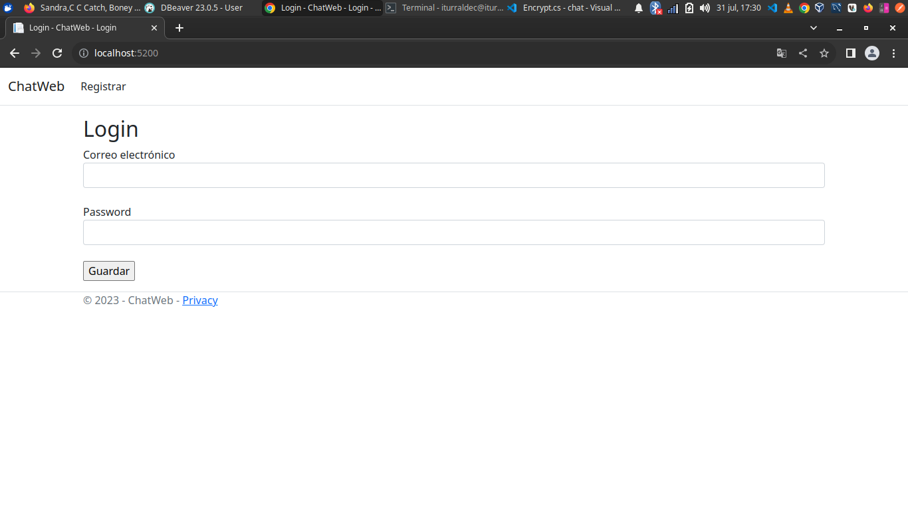
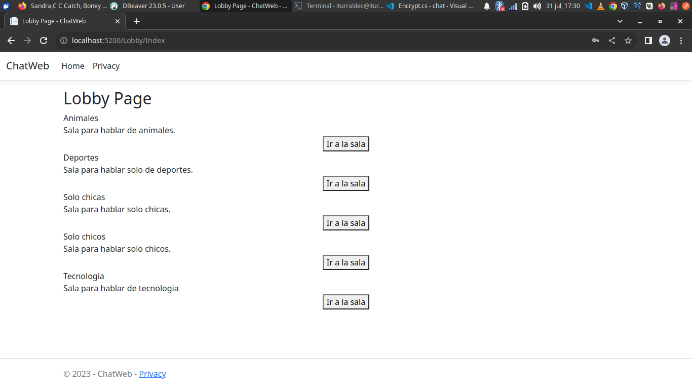
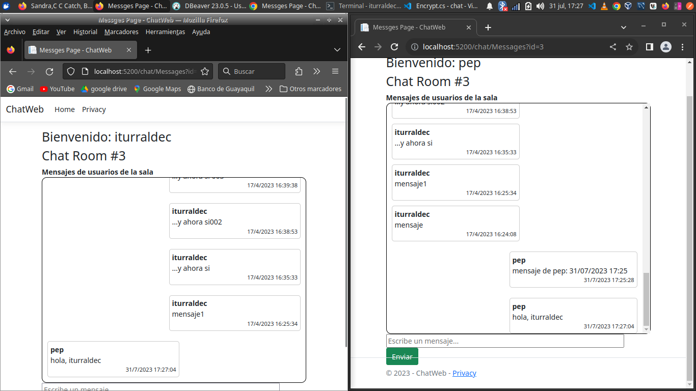
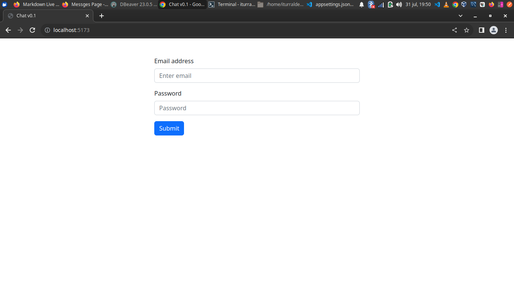
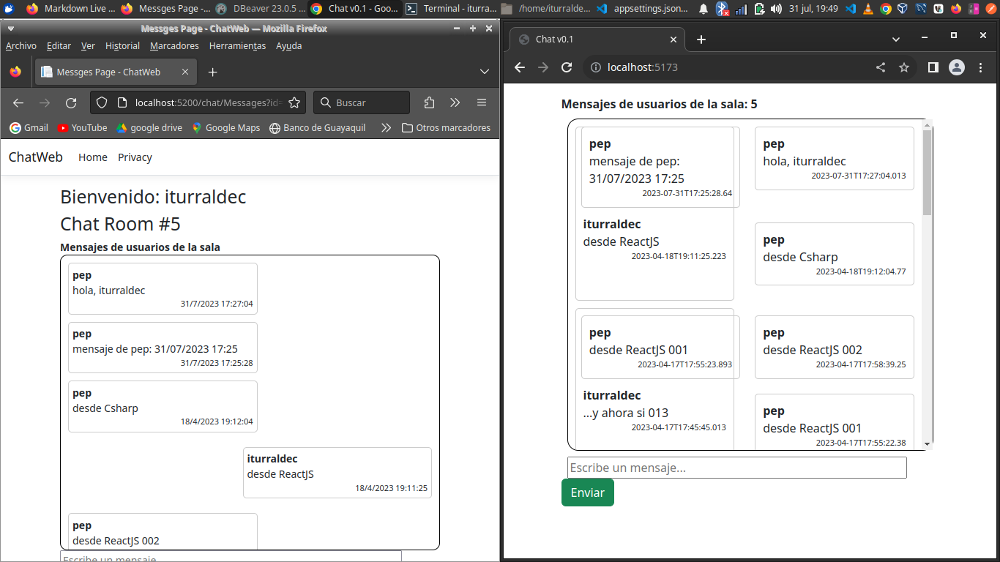

# Aplicación Chat Web, con C#

## Descripción

Aplicación que simula un chat web basada en el framework de Microsoft Asp.Net Core 7.0 (MVC), EntityFrameworkCore y React.

### La solución consta de 4 proyectos:
1. Utilidades del chat (/UtilitiesChat/)
2. Web Service (/ChatWS/)
3. Proyecto MVC para la interacciòn con el usuario (/ChatWeb/)
4. Proyecto React v18 para interacción con el usuario (/ChatReact/)

## Instalación

Asegurate de:
- Tener instalado los Runtimes de AspNetCore 7 (ó 6)
- Tener instalado el Manejador de base de datos SQL Server
- Tener instalada la base de datos 'chat', una copia de la misma se encuentra en el archivo **/ChatWS/assets/db/chat.bak**
- Cambiar la cadena de conexión a la base de datos con las credenciales correspondientes en el archivo **ChatWS/Data/ChatContext.cs**

- En el archivo **ChatWeb/appsettings.json** establce la url del web service de tu maquina ne la llave "UrlWS"
- Si quieres ejecutar el frontend de React deberas cambiar la url al web service en el archivo **ChatReact/src/Romm.jsx** e instalar las dependencias con **npm install**

## Uso
Una vez descargada la aplicación tendras que ejecutar el web service (ChatWS) y separadamente el proyecto MVC (ChatWeb) y/o el proyecto React (ChatReact).
Existen dos usuarios de pruebas:
1. iturraldec@gmail.com
2. pepe@gmail.com

Ambos usuarios tienen la contraseña '12345'

    
## Licencia

GNU GPL
